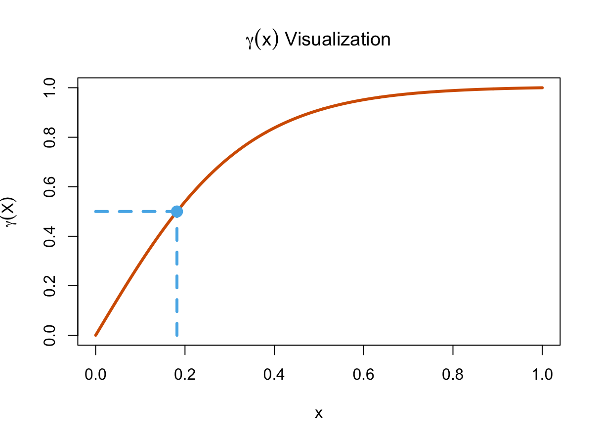
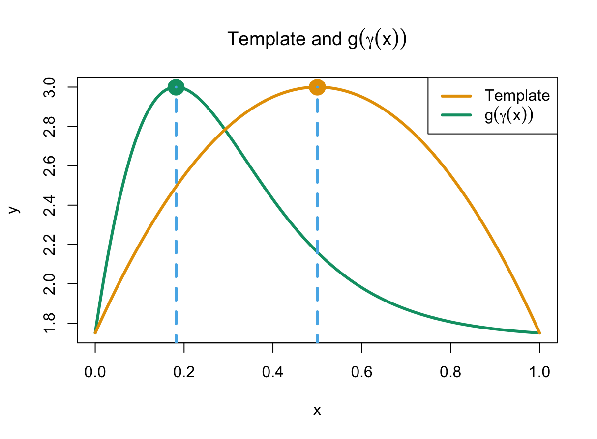

# Stationary Point Constrained Regression Via Diffeomorphisms

Supplementary Package for *Stationary Point Constrained Regression via Diffeomorphisms* by Price et al. We propose a nonparametric regression framework where we specify the number of *stationary points*, or points where the derivative equals 0. We represent the function as a composition of a simple *template* function $g$ (a differentiable interpolation with specified stationary points) and a *diffeomorphism* $\gamma$, a bijective, differentiable mapping of the input space $[a, b]$. Put mathematically,

``` math
y_{i} = g(\gamma(x_{i})) + \epsilon_{i} \quad \epsilon_{i} \sim N(0, \sigma^2)
```

In turn, stationary points of the function can be estimated by calculating $\gamma^{-1}(b_{i})$, where $b_{i}$ is a stationary point of the template. These diffeomorphisms can be represented by a transformation of a finite orthogonal basis of square integrable functions, like the cosine basis. A visualization is provided below. Notice that stationary points of the composition and the template correspond to a certain (x, y) point in the first graph.

 

## Installation

To install the package, copy this code into your R console

```         
library(devtools)
devtools::install_github('mprice747/scrdiff')
```

## Usage

To load the package, copy this code into your R console or script

```         
library(scrdiff)
```

This package performs Bayesian Inference on the model parameters using a simple aggregate Metropolis-Hastings scheme. Multiple chains are initialized near the posterior modes. Calling **posterior_stat_points_diff_mcmc** runs MCMC on the model parameters and posterior samples of the stationary points along with the MAP estimate of the stationary points are outputted. A through example with an explanation of the model parameters is provided in the vignette.
